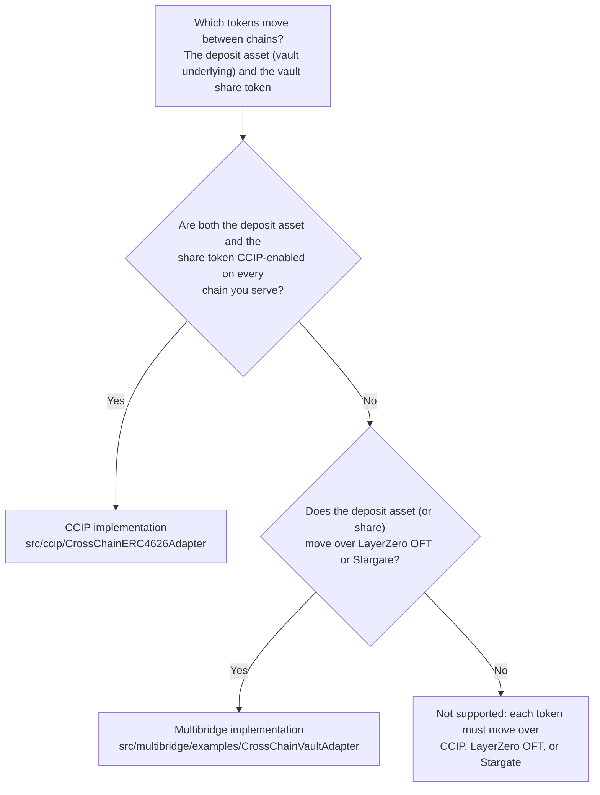

# Cross-chain vault adapters

Reference Solidity contracts that make an ERC-4626 vault reachable from other chains. A user
bridges the vault asset or the vault share token to an adapter on the vault's chain, and the adapter deposits or
redeems, then delivers the result locally or bridges it back.

This repository contains two implementations that solve the same problem in different ways.

## Choosing an implementation



1. **The vault's deposit asset and share token are both CCIP-enabled** on the chains you serve: use the
   [CCIP implementation](docs/ccip/README.md) (`src/ccip/CrossChainERC4626Adapter.sol`). It also supports CCIP v2
   lanes (configurable finality and Cross-Chain Verifiers).
2. **The deposit asset (or the share token) is bridged over LayerZero OFT or Stargate**, alone or alongside CCIP: use
   the [multibridge implementation](docs/multibridge/README.md) (`src/multibridge/examples/CrossChainVaultAdapter.sol`).
   It uses CCIP v1 lanes for its CCIP rail.

Two further constraints can decide it:

- **The chain doesn't support the Shanghai upgrade (`PUSH0`)**: only the multibridge implementation deploys there (see
  [Chain compatibility](#chain-compatibility)).
- **You need CCIP v2 lanes**: only the CCIP implementation supports them.

Both implementations support Solana (SVM) lanes over CCIP and deliver results on the vault's own chain (no bridge) or
back to a source chain. The table compares them in more detail:

| | [CCIP](docs/ccip/README.md) | [Multibridge](docs/multibridge/README.md) |
|---|---|---|
| Bridges | Chainlink CCIP | Chainlink CCIP, LayerZero V2 OFT, Stargate V2 |
| Use when | The vault asset **and** the share token are both CCIP-enabled | Either token moves over LayerZero or Stargate, or you need several rails at once |
| CCIP versions | CCIP v1 and v2 lanes in one contract (return-leg `extraArgs` format set per lane) | CCIP v1 (`GenericExtraArgsV2`) |
| Vault types | ERC-4626 | ERC-4626 |
| Solana (SVM) lanes | Yes | Yes (`CCIP_SVM` rail) |
| Shape | One flat contract ([`CrossChainERC4626Adapter`](src/ccip/CrossChainERC4626Adapter.sol)) plus a deploy-and-configure factory | Transport base + route registry + vault adapter ([`CrossChainVaultAdapter`](src/multibridge/examples/CrossChainVaultAdapter.sol)), deployed as EIP-1167 clones through `CrossChainVaultAdapterFactory` |
| Customize by | Editing the message processing logic in the one contract | Inheriting `MultiChannelBridgeAdapter` / `RouteRegistry` and overriding `_handleReceive` |
| EVM chains | Shanghai or later (`PUSH0`) | Any (paris bytecode) |

Read [`DISCLAIMER`](DISCLAIMER) before using any of this code.

## Repository layout

Each implementation lives in its own subdirectory of the standard Foundry folders, so you can read, test, or
remove one without touching the other.

```text
src/                  contracts (frozen)
  ccip/               CrossChainERC4626Adapter, CrossChainERC4626AdapterFactory
  ccip/dev/           ExampleERC4626Vault (unaudited example vault for testnet tutorials)
  multibridge/        MultiChannelBridgeAdapter, routing/RouteRegistry, stargate/IStargate,
                      examples/CrossChainVaultAdapter, CrossChainVaultAdapterFactory
test/
  ccip/               unit and script tests + mocks/
  multibridge/        unit, integration, script and fork tests + mocks/
script/
  ccip/               deploy, configure and check scripts
  multibridge/        deploy scripts, network address book, Sepolia and Tenderly helpers
config/multibridge/   JSON inputs for the multibridge deploy scripts
deployments/          deploy script outputs per implementation (git-ignored except .gitkeep)
e2e/
  ccip/               live-network E2E harness (CCIP SDK + ethers)
  multibridge/        Tenderly and testnet E2E harness (CCIP SDK, LayerZero, viem)
frontend/
  ccip/               reference dashboard for CrossChainERC4626Adapter (Vite + React, not audited)
  multibridge/        reference dashboard for CrossChainVaultAdapter (Vite + React, not audited)
docs/
  ccip/               user journey, operator, deployment, and contract reference guides
  multibridge/        architecture, operator and integrator guides, and the GitBook source
tools/                contract size gate used by CI
```

## Quickstart

Prerequisites: [Foundry](https://book.getfoundry.sh/getting-started/installation) (CI pins `v1.7.1`),
Node.js 20.11+ (CI uses 24), and pnpm 10 (`corepack enable` picks up the pinned `pnpm@10.11.1`).

```bash
git clone https://github.com/smartcontractkit/cross-chain-vault-adapters.git
cd cross-chain-vault-adapters
pnpm install
forge build
pnpm test
```

All Solidity dependencies come from npm through `remappings.txt`; there are no git submodules.

| Command | What it does |
|---|---|
| `pnpm test` | All Foundry tests except the multibridge fork tests |
| `pnpm test:ccip` / `pnpm test:multibridge` | One implementation's tests |
| `pnpm test:fork` | Multibridge fork tests against live testnets (reads `HUB_RPC_URL` etc., uses public RPCs by default) |
| `pnpm sizes` | Builds with `[profile.deploy]` and enforces EIP-170 / EIP-3860 (see [Contract sizes](#contract-sizes)) |
| `pnpm e2e:ccip <script>` | Runs a script from [`e2e/ccip`](e2e/ccip/README.md), for example `pnpm e2e:ccip suite --list` |
| `pnpm e2e:multibridge <script>` | Runs a script from [`e2e/multibridge`](e2e/multibridge/README.md), for example `pnpm e2e:multibridge initiate` |
| `pnpm --filter ./frontend/ccip dev` | Runs the [CCIP reference frontend](frontend/ccip/README.md) (`build`, `preview`, `typecheck` also available) |
| `pnpm --filter ./frontend/multibridge dev` | Runs the [multibridge reference frontend](frontend/multibridge/README.md) |

E2E harnesses send real transactions. Each reads its own `.env` (copy `e2e/<implementation>/.env.example`).

## Compiler settings

The contracts under `src/` are frozen.

Each implementation compiles with its own pinned settings. `foundry.toml` sets them per directory with
`compilation_restrictions`, so a plain `forge build` produces the intended bytecode:

| Paths | solc | EVM | Optimizer |
|---|---|---|---|
| `src/ccip`, `test/ccip`, `script/ccip` | 0.8.24 | cancun | `via_ir`, 1 run |
| `src/multibridge`, `test/multibridge`, `script/multibridge` | 0.8.26 | paris | 200 runs (tests); `FOUNDRY_PROFILE=deploy` for deployment: `via_ir`, 1 run |

The test VM runs on cancun (`evm_version` in `[profile.default]`) so the CCIP adapter's cancun bytecode executes.

### Chain compatibility

- **Multibridge (`CrossChainVaultAdapter`)**: compiled for paris, so it deploys on any EVM chain.
- **CCIP (`CrossChainERC4626Adapter`)**: the build targets cancun, but its bytecode is identical to a
  shanghai build, so the only post-paris opcode it uses is `PUSH0`. Deploy it only on chains that support the Shanghai
  upgrade (`PUSH0`). Recompiling it for paris would change its bytecode.

Two remapping details are worth knowing if you add code:

- `@chainlink/contracts-ccip/` resolves to CCIP **2.0.0**. Files under `src/multibridge`, `test/multibridge`, and
  `script/multibridge` get CCIP **1.6.4** through context remappings. New code can use the canonical
  `@chainlink/ccip/` alias.
- The bare `@openzeppelin/contracts/` alias resolves to OpenZeppelin **5.1.0** (what the multibridge code and
  LayerZero packages are built against). The CCIP implementation imports the versioned `@openzeppelin/contracts@4.8.3/`
  and `@openzeppelin/contracts@5.0.2/` aliases.

## Contract sizes

`pnpm sizes` builds with `[profile.deploy]` and fails if any contract exceeds EIP-170 (24,576-byte runtime) or
EIP-3860 (49,152-byte initcode). Every contract fits; the largest is `CrossChainVaultAdapter` at 24,457 bytes, 119
bytes under the limit, so almost any addition to it will need size work.
[`tools/size-allowlist.json`](tools/size-allowlist.json) can exempt a contract that is intentionally deployed only
on chains without EIP-170; it is empty.

## Lint

CI (`.github/workflows/test.yml`) runs these gates in order. Run them locally before opening a PR:

```bash
forge fmt --check
pnpm solhint
pnpm solhint-test
forge build
pnpm sizes
pnpm test
```

- `pnpm solhint` lints `src/` with the Chainlink [`chainlink-solidity`](https://github.com/smartcontractkit/chainlink-solhint-rules)
  solhint plugin. The contract sources are frozen, so the gate is ratcheted at the existing warning count per
  implementation (`solhint:ccip` at 17, `solhint:multibridge` at 26) and fails on any new warning.
- `pnpm solhint-test` lints `test/` and `script/` with `--max-warnings 0`.
- `forge fmt` uses the Chainlink `[fmt]` profile and skips `src/`.
- A second CI job typechecks both E2E harnesses and typechecks and builds both frontends
  (`pnpm --filter "./e2e/*" typecheck`, `pnpm --filter "./frontend/*" typecheck` / `build`).
- Optional: `slither .` runs static analysis with [`slither.config.json`](slither.config.json) (install
  [Slither](https://github.com/crytic/slither) separately; it is not a CI gate).

## Forking this repository

To keep only one implementation, delete the other one's directories and its config lines:

- **Keep ccip:** delete `src/multibridge`, `test/multibridge`, `script/multibridge`, `config/multibridge`,
  `deployments/multibridge`, `e2e/multibridge`, `frontend/multibridge`, and `docs/multibridge`. Then remove the `multibridge` entries from
  `compilation_restrictions` and `additional_compiler_profiles` in `foundry.toml`, the `*/multibridge/:` context
  remappings and the LayerZero, `solidity-bytes-utils`, and `contracts-upgradeable` remappings with their npm
  dependencies (plus `@chainlink/contracts-ccip-1.6.4`), `[profile.deploy]` and the `hub` / `spoke_*` RPC aliases in
  `foundry.toml`, and the `solhint:multibridge`, `test:multibridge`, `test:fork`, `e2e:multibridge`, `multibridge:*` and
  `sizes` scripts.
- **Keep multibridge:** delete `src/ccip`, `test/ccip`, `script/ccip`, `e2e/ccip`,
  `frontend/ccip`, `deployments/ccip`, `docs/ccip`, and the root `.env.example` (it only configures the
  CCIP scripts). Then remove the `ccip` entries from `compilation_restrictions`,
  `additional_compiler_profiles` and `[rpc_endpoints]` in `foundry.toml`, the `solhint:ccip`, `test:ccip`,
  `e2e:ccip` and `ccip:*` scripts, and the `@openzeppelin/contracts-4.8.3` / `-5.0.2` dependencies.

Put new contracts under a `dev/` directory until they are reviewed, and give each new implementation its own `compilation_restrictions` entry.

## Deploying

- CCIP: `cp .env.example .env`, fill it in, then `pnpm ccip:deploy --rpc-url ccip` (dry run),
  add `--account <keystore> --broadcast` to deploy, `pnpm ccip:configure` for CCIP v2 lanes and funding, and
  `pnpm ccip:check` to verify. Step by step in the
  [deployment guide](docs/ccip/cross-chain-erc4626-adapter-deployment-guide.md); operations in the
  [operator guide](docs/ccip/cross-chain-erc4626-adapter-operator-guide.md).
- Example vault (testnets only):
  `pnpm ccip:deploy-example-vault --rpc-url ccip --account <keystore> --broadcast --verify --delay 20 --retries 12`
  deploys `ExampleERC4626Vault` from `src/ccip/dev/`. It is OpenZeppelin `ERC4626` and `Ownable` with only a
  constructor, so shares convert 1:1 to the asset until the vault receives assets outside `deposit` and `mint`, and
  `owner()` lets you register the share token's CCIP admin. Set `VAULT_ASSET`, `VAULT_NAME` and `VAULT_SYMBOL`
  (optional `VAULT_OWNER`, default the broadcaster). The Chainlink documentation tutorials use it as the vault behind
  the adapter. It is not audited: use your own vault in production.
- Multibridge: `pnpm multibridge:deploy-factory --rpc-url <rpc> --account <keystore> --broadcast` publishes the
  implementation and factory, after which each vault issuer calls `factory.deploy(DeployConfig)`
  ([deployment](docs/multibridge/operator/DEPLOYMENT.md)). `pnpm multibridge:deploy` does a full multi-network
  deploy from `config/multibridge/deployment.json` ([production deployment config](docs/multibridge/operator/DEPLOYMENT_CONFIG.md)).
  Both use the `[profile.deploy]` compiler settings. Operations are in the
  [operator guide](docs/multibridge/operator/OPERATOR_GUIDE.md).

## Security

See [SECURITY.md](SECURITY.md). Do not open public issues for security reports.

## License

[MIT](LICENSE). See also [`DISCLAIMER`](DISCLAIMER).
