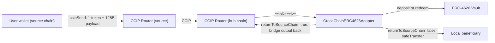

# CrossChainERC4626Adapter frontend integration guide

> **Purpose of this document.** This is a self-contained brief for developers (or coding
> agents) extending an existing CCIP (Chainlink Cross-Chain Interoperability Protocol)
> message-builder UI, for example one based on `@chainlink/ccip-sdk` + `wagmi` +
> `RainbowKit` + `viem`. After reading this, you should be able to:
>
> 1. Take a pasted adapter address + a selected network and read the full
>    on-chain state of a `CrossChainERC4626Adapter` deployment (config, roles, vaults,
>    fees, failed messages, activity).
> 2. Display that state usefully.
> 3. Use the CCIP SDK to build, validate, and initiate the same cross-chain
>    deposit / redeem / refund / local-recovery transactions that the repo's live-network
>    E2E harness ([`e2e/ccip/`](../../e2e/ccip/README.md)) builds by hand.
>
> A working reference frontend that implements this guide lives in
> [`frontend/ccip/`](../../frontend/ccip/README.md) (Vite + React, Reown AppKit with
> ethers for EVM wallets, `@solana/wallet-adapter`, `viem`, `@chainlink/ccip-sdk`). It is a
> reference implementation only and has not been audited. Its adapter ABI is in
> [`frontend/ccip/client/src/lib/adapter/abi.ts`](../../frontend/ccip/client/src/lib/adapter/abi.ts).
>
> The canonical message-building logic this UI must reproduce lives in
> [`e2e/ccip/shared.ts`](../../e2e/ccip/shared.ts) and
> [`e2e/ccip/scenarios.ts`](../../e2e/ccip/scenarios.ts). The contract source of truth is
> [`src/ccip/CrossChainERC4626Adapter.sol`](../../src/ccip/CrossChainERC4626Adapter.sol). A narrative
> reference is [`docs/ccip/cross-chain-erc4626-adapter-contract-reference.md`](cross-chain-erc4626-adapter-contract-reference.md).

---

## 1. Mental model

`CrossChainERC4626Adapter` is a CCIP receiver deployed on a "hub" chain (the chain
where the ERC-4626 vaults live). Users on remote source chains send a CCIP
programmable token transfer to the adapter:

- The CCIP message carries exactly one token (`tokenAmounts` length must be `1`) plus
  a 128-byte `data` payload.
- The adapter decodes the payload, finds the target vault, and runs one of two paths:
  - Deposit — inbound token equals the vault's `asset()` → `vault.deposit(...)`,
    output is vault shares.
  - Redeem — inbound token equals the vault share token (`target` itself) →
    `vault.redeem(...)`, output is underlying asset.
- The output is either bridged back to the source chain (`returnToSourceChain = true`)
  or delivered locally to a beneficiary on the hub chain (`returnToSourceChain = false`).
- If processing reverts, the message is persisted as failed and can be recovered via
  cross-chain refund (permissionless) or local recovery (only by the encoded
  `localRefundAddress`).



Key consequences for the UI:

- The adapter lives on the destination/hub chain. Read all adapter state from that
  chain's RPC.
- The **vaults are not enumerable on-chain.** Discover them by scanning `TargetEnabled`
  events (see §5.3).
- The destination execution gas is paid by the source send via `extraArgs.gasLimit`,
  not configured on the adapter. Estimate it with `estimateReceiveExecution` (see §8.4).
- A send only succeeds if the source token is a CCIP-enabled lane token to the hub
  chain, and its delivered representation matches `vault.asset()` (deposit) or `target`
  (redeem) on the hub chain.

---

## 2. Recommended stack

This guide assumes the host UI already uses (or can add):

| Concern | Library |
|---|---|
| EVM wallet connect / chain switching | `wagmi` v2 + `@rainbow-me/rainbowkit` |
| EVM reads / encoding | `viem` v2 (or `ethers` v6 — both shown) |
| CCIP fee quote, gas estimate, send, status | `@chainlink/ccip-sdk` 1.x (the reference frontend pins 1.8.0, the E2E harness 1.4.2) |
| Async state | `@tanstack/react-query` |
| Solana (SVM, Solana Virtual Machine) source (optional) | `@solana/web3.js` + wallet adapter |

> The repo's reference frontend ([`frontend/ccip/`](../../frontend/ccip/README.md)) uses Reown AppKit
> (ethers adapter) instead of `wagmi` + RainbowKit; the adapter-facing logic is the same.
>
> The CCIP SDK is the source of truth for chain selectors, fee quoting, gas estimation,
> unsigned-tx generation, and message-status tracking. Do not hardcode chain selectors;
> derive them from `networkInfo(networkId)`.

Install (host app):

```bash
npm i @chainlink/ccip-sdk viem wagmi @rainbow-me/rainbowkit @tanstack/react-query
```

---

## 3. Configuration files

Two config layers. Keep them in your app's config directory (the reference frontend uses
[`frontend/ccip/client/src/config/`](../../frontend/ccip/client/src/config/), for example
[`adapters.config.ts`](../../frontend/ccip/client/src/config/adapters.config.ts)).

### 3.1 Networks (`networks.ts`)

Use CCIP SDK network IDs (e.g. `ethereum-testnet-sepolia`, `avalanche-testnet-fuji`,
`solana-devnet`). Everything else (selector, family) comes from `networkInfo(networkId)`.

```ts
import { networkInfo } from "@chainlink/ccip-sdk";

export type NetworkConfig = {
  networkId: string;        // CCIP SDK network id
  label: string;            // UI label
  rpcUrl: string;           // override; falls back to a public RPC
  routerAddress: `0x${string}`; // CCIP Router on this chain (source sends use this)
  blockExplorerTx: string;  // `${base}/tx/`
  // Convenience, derived at runtime — do not hardcode if avoidable:
  get chainSelector(): bigint;
  get family(): "EVM" | "SVM" | "Aptos";
};

export const NETWORKS: Record<string, Omit<NetworkConfig, "chainSelector" | "family">> = {
  "ethereum-testnet-sepolia": {
    networkId: "ethereum-testnet-sepolia",
    label: "Ethereum Sepolia",
    rpcUrl: import.meta.env.VITE_RPC_11155111 ?? "https://ethereum-sepolia-public.nodies.app",
    routerAddress: "0x0BF3dE8c5D3e8A2B34D2BEeB17ABfCeBaf363A59",
    blockExplorerTx: "https://sepolia.etherscan.io/tx/",
  },
  "avalanche-testnet-fuji": {
    networkId: "avalanche-testnet-fuji",
    label: "Avalanche Fuji",
    rpcUrl: import.meta.env.VITE_RPC_43113 ?? "https://avalanche-fuji-c-chain-rpc.publicnode.com",
    routerAddress: "0xF694E193200268f9a4868e4Aa017A0118C9a8177",
    blockExplorerTx: "https://testnet.snowtrace.io/tx/",
  },
  // add base-sepolia, solana-devnet, etc.
};

// Selector + family are always derived:
export function selectorOf(networkId: string): bigint {
  return networkInfo(networkId).chainSelector;
}
export function familyOf(networkId: string): "EVM" | "SVM" | "Aptos" {
  return networkInfo(networkId).family as "EVM" | "SVM" | "Aptos";
}
```

Testnet router addresses and explorer bases used in this repo (routers from
[`frontend/ccip/client/src/config/ccip.config.ts`](../../frontend/ccip/client/src/config/ccip.config.ts) and
[`e2e/ccip/.env.example`](../../e2e/ccip/.env.example), explorers from [`e2e/ccip/report.ts`](../../e2e/ccip/report.ts)).
Confirm them in the [CCIP directory](https://docs.chain.link/ccip/directory/testnet):

| Network id | Router | Explorer tx base |
|---|---|---|
| `ethereum-testnet-sepolia` | `0x0BF3dE8c5D3e8A2B34D2BEeB17ABfCeBaf363A59` | `https://sepolia.etherscan.io/tx/` |
| `avalanche-testnet-fuji` | `0xF694E193200268f9a4868e4Aa017A0118C9a8177` | `https://testnet.snowtrace.io/tx/` |
| `ethereum-testnet-sepolia-base-1` | (per CCIP directory) | `https://sepolia.basescan.org/tx/` |
| `solana-devnet` | `Ccip842gzYHhvdDkSyi2YVCoAWPbYJoApMFzSxQroE9C` | `https://explorer.solana.com/tx/` |

### 3.2 Supported vaults / adapters registry (`adapters.ts`)

The user can paste any adapter address + pick a network. Keep an optional seed
registry for known deployments and for per-vault display hints (token logos, names,
trusted source lanes). Anything not in the registry is still fully discoverable on-chain.

```ts
export type VaultHint = {
  vaultAddress: `0x${string}`; // ERC-4626 vault on the hub chain
  displayName?: string;
  // Optional per-source-chain bridged token addresses, used to prefill the
  // "what token do I send from the source chain?" field. These are CCIP lane tokens.
  // The reference frontend keys this map by source chain selector instead of network id.
  sourceTokens?: Record<string /* sourceNetworkId */, {
    assetToken?: `0x${string}`; // bridge this to DEPOSIT (maps to vault.asset() on hub)
    shareToken?: `0x${string}`; // bridge this to REDEEM (maps to `target` share token on hub)
  }>;
};

export type AdapterEntry = {
  adapterAddress: `0x${string}`;
  hubNetworkId: string;        // network where the adapter is deployed
  label?: string;
  vaultHints?: VaultHint[];    // optional; discovery still works without these
};

export const KNOWN_ADAPTERS: AdapterEntry[] = [
  {
    adapterAddress: "0x7F1f21a2CedD1f1771731330e49b92B484E5C775",
    hubNetworkId: "ethereum-testnet-sepolia",
    label: "Sepolia demo adapter",
    vaultHints: [
      {
        vaultAddress: "0x525a9B5D84EB3C388263fE08667DB0251848FF4b",
        displayName: "Demo vUSDC vault",
        sourceTokens: {
          "avalanche-testnet-fuji": {
            assetToken: "0xD21341536c5cF5EB1bcb58f6723cE26e8D8E90e4", // CCIP-BnM/USDC on Fuji
            shareToken: "0xBaC503B53C9468f2A92De6aD60CD17ac951eF707", // bridged vault share on Fuji
          },
        },
      },
    ],
  },
];
```

> **Why bridged source tokens matter:** the adapter routes by comparing the delivered
> token to `vault.asset()` / `target` on the hub. The user must send the CCIP lane token
> on the source chain whose delivered representation equals one of those. The UI cannot
> infer this from the hub addresses alone, so let the user pick from `sourceTokens` hints or
> enter a custom source token, and validate via `preview()` + a CCIP lane support check.

---

## 4. Loading the adapter (entry flow)

1. User pastes `adapterAddress` and selects `hubNetworkId`.
2. Validate the address (`viem.isAddress`).
3. Build a `publicClient` for the hub chain and an `EVMChain` SDK instance:

```ts
import { createPublicClient, http, getAddress } from "viem";
import { EVMChain } from "@chainlink/ccip-sdk";
import { NETWORKS } from "./config/networks";

export async function loadAdapterContext(adapterAddress: string, hubNetworkId: string) {
  const net = NETWORKS[hubNetworkId];
  if (!net) throw new Error(`unknown network ${hubNetworkId}`);
  const adapter = getAddress(adapterAddress);

  const publicClient = createPublicClient({ transport: http(net.rpcUrl) });
  const hubChain = await EVMChain.fromUrl(net.rpcUrl); // SDK chain for fees/gas/send/status

  // Sanity: confirm it really is this adapter
  const typeAndVersion = await publicClient.readContract({
    address: adapter, abi: ADAPTER_ABI, functionName: "typeAndVersion",
  });
  // Anchored so the factory ("CrossChainERC4626AdapterFactory 1.0.0") is rejected.
  if (!/^CrossChainERC4626Adapter \d+\.\d+\.\d+/.test(String(typeAndVersion))) {
    throw new Error(`address is not a CrossChainERC4626Adapter (got "${typeAndVersion}")`);
  }
  return { adapter, hubNetworkId, net, publicClient, hubChain };
}
```

> The current release reports `"CrossChainERC4626Adapter 1.0.0"`. Use it as a guardrail so
> users don't point the UI at an unrelated contract. A plain `startsWith("CrossChainERC4626Adapter")`
> check is not enough, because it also matches the factory.

---

## 5. Reading the full contract state

All reads target the hub chain. The adapter exposes plain getters for scalars and
mappings, enumerable role membership (via OpenZeppelin `AccessControlEnumerable`), and
emits events for everything that is mapping-keyed and therefore not enumerable.

### 5.1 Global scalars (single multicall)

| Getter | Type | Meaning |
|---|---|---|
| `typeAndVersion()` | `string` | `"CrossChainERC4626Adapter 1.0.0"` |
| `ROUTER()` | `address` | Immutable CCIP router authorized to call `ccipReceive` |
| `depositsEnabled()` | `bool` | Global deposit killswitch |
| `redeemsEnabled()` | `bool` | Global redeem killswitch |
| `CCIP_MESSAGE_PAYLOAD_LENGTH()` | `uint256` | Always `128` |
| `FEE_SETTER_ROLE()` | `bytes32` | Role id for fee setters |
| `FEE_COLLECTOR_ROLE()` | `bytes32` | Role id for fee collectors |

```ts
const [typeAndVersion, router, depositsEnabled, redeemsEnabled] = await publicClient.multicall({
  allowFailure: false,
  contracts: [
    { address: adapter, abi: ADAPTER_ABI, functionName: "typeAndVersion" },
    { address: adapter, abi: ADAPTER_ABI, functionName: "ROUTER" },
    { address: adapter, abi: ADAPTER_ABI, functionName: "depositsEnabled" },
    { address: adapter, abi: ADAPTER_ABI, functionName: "redeemsEnabled" },
  ],
});
```

### 5.2 Roles (enumerable)

`DEFAULT_ADMIN_ROLE` is `0x00…00` (`bytes32(0)`). `FEE_SETTER_ROLE` and
`FEE_COLLECTOR_ROLE` are `keccak256("FEE_SETTER_ROLE")` /
`keccak256("FEE_COLLECTOR_ROLE")` — read them from the contract constants rather than
recomputing. Enumerate members:

```ts
const DEFAULT_ADMIN_ROLE = "0x0000000000000000000000000000000000000000000000000000000000000000";

async function roleMembers(role: `0x${string}`) {
  const count = await publicClient.readContract({
    address: adapter, abi: ADAPTER_ABI, functionName: "getRoleMemberCount", args: [role],
  });
  const members = await Promise.all(
    Array.from({ length: Number(count) }, (_, i) =>
      publicClient.readContract({
        address: adapter, abi: ADAPTER_ABI, functionName: "getRoleMember", args: [role, BigInt(i)],
      })
    )
  );
  return members as `0x${string}`[];
}
// roleMembers(DEFAULT_ADMIN_ROLE), roleMembers(feeSetterRole), roleMembers(feeCollectorRole)
// To check the connected wallet's powers: hasRole(role, account)
```

### 5.3 Discover vaults (event scan + verify)

There is **no on-chain vault enumeration.** Discover targets from `TargetEnabled` logs,
collapse to the latest state per target, then verify with `enabledTargets(target)` and read
ERC-4626 metadata.

```ts
import { parseAbiItem } from "viem";

const TargetEnabledEvent = parseAbiItem("event TargetEnabled(address indexed target, bool enabled)");

async function discoverVaults() {
  const logs = await publicClient.getLogs({
    address: adapter,
    event: TargetEnabledEvent,
    fromBlock: 0n,        // or a known deploy block; chunk for RPCs that cap ranges (see note)
    toBlock: "latest",
  });

  // Latest state wins per target (logs are returned in ascending block/log order)
  const latest = new Map<string, boolean>();
  for (const log of logs) latest.set(getAddress(log.args.target!), log.args.enabled!);

  const targets = [...latest.entries()].map(([target, enabled]) => ({ target, enabled }));

  // Verify current state + load ERC-4626 metadata for each
  return Promise.all(targets.map(async ({ target }) => {
    const isEnabled = await publicClient.readContract({
      address: adapter, abi: ADAPTER_ABI, functionName: "enabledTargets", args: [target as `0x${string}`],
    });
    const meta = await readVaultMetadata(target as `0x${string}`);
    return { target, enabled: isEnabled, ...meta };
  }));
}
```

> **RPC range limits.** Many public RPCs cap `eth_getLogs` block ranges (e.g. 10k blocks).
> Implement chunked scanning from the adapter's deploy block to `latest`, and cache results
> in `localStorage` keyed by `(network, adapter, lastScannedBlock)`. Persist the deploy
> block once discovered (first `TargetEnabled` / first tx).

### 5.4 Per-vault ERC-4626 metadata

```ts
const ERC4626_ABI = [
  "function asset() view returns (address)",
  "function name() view returns (string)",
  "function symbol() view returns (string)",
  "function decimals() view returns (uint8)",
  "function totalAssets() view returns (uint256)",
  "function totalSupply() view returns (uint256)",
  "function convertToAssets(uint256 shares) view returns (uint256)",
  "function previewDeposit(uint256 assets) view returns (uint256)",
  "function previewRedeem(uint256 shares) view returns (uint256)",
];

async function readVaultMetadata(vault: `0x${string}`) {
  const asset = await publicClient.readContract({ address: vault, abi: ERC4626_ABI, functionName: "asset" });
  const [vName, vSymbol, vDecimals] = await Promise.all([/* name, symbol, decimals on vault */]);
  const [aName, aSymbol, aDecimals] = await Promise.all([/* same on asset */]);
  return { asset, share: { name: vName, symbol: vSymbol, decimals: vDecimals },
           underlying: { address: asset, name: aName, symbol: aSymbol, decimals: aDecimals } };
}
```

Display per vault: share token (name/symbol/decimals + `target` address), underlying asset
(name/symbol/decimals + address), `totalAssets`, `totalSupply`, and an example
`convertToAssets(1 share)` exchange rate. **Important:** vault `asset()` decimals and share
decimals can differ — always read both; never assume 18 or 6.

### 5.5 Configured chains (event scan + verify)

`chains(uint64)` returns `ChainType` (`0=NONE, 1=EVM, 2=SVM`). Discover configured
selectors via `ChainTypeSet`, then read `chains(selector)` for current value. Map each
selector back to a network id via `networkInfo` if known.

```ts
const ChainTypeSetEvent = parseAbiItem("event ChainTypeSet(uint64 indexed chainSelector, uint8 chainType)");
// collapse to latest per selector, then chains(selector) to confirm. NONE means disabled.
```

> Inbound is gated by `chains[sourceChainSelector] != NONE` (the `onlyValidChain`
> modifier). The UI must only offer source chains whose selector is configured non-`NONE`,
> or the adapter records the message as failed (`MessageFailed`, `messageErrorCode == BASIC`)
> and the tokens wait for a refund or local recovery. The CCIP Explorer still shows such a
> message as SUCCESS, because `ccipReceive` catches the error (see §10.3).

### 5.6 Asset fees (return-leg flat fees)

`assetFees(uint64 destinationChainSelector, address bridgedToken)` → `uint256` (in vault
underlying smallest units). These apply only when `returnToSourceChain = true`.
Discover the `(selector, token)` keys via `AssetFeeSet`, then re-read current values.

```ts
const AssetFeeSetEvent = parseAbiItem(
  "event AssetFeeSet(uint64 indexed destinationChainSelector, address indexed bridgedToken, uint256 fee)"
);
// For each discovered (selector, token): assetFees(selector, token)
```

> Fee key semantics: on a deposit-return the bridged token is the vault share token
> (`target`); on a redeem-return it is the underlying asset. The `fee` is always in
> the vault's underlying units. Use this to show "you will receive ~X after a flat fee of Y".

### 5.7 Collected fees (treasury)

`collectedFees(address asset)` → `uint256`. Fees are always skimmed in the vault's
underlying asset (on both deposit-return and redeem-return), so the fee-bearing assets are
the underlyings of the vaults you discovered. Read `collectedFees(underlying)` for each.
Cross-reference `FeeWithdrawn(asset, recipient, amount)` events for a withdrawal history.

### 5.8 CCIP v2 CCV (Cross-Chain Verifier) and finality config (per source chain)

```ts
// getCCVsAndFinalityConfig(sourceChainSelector, "0x")
// returns (address[] requiredCCVs, address[] optionalCCVs, uint8 optionalThreshold, bytes4 allowedFinalityConfig)
```

`allowedFinalityConfig` == `inboundFinality(sourceChainSelector)` (a `bytes4` bitmask;
`0x00000000` = wait-for-finality default). CCV arrays are only meaningful on CCIP v2 lanes.
Discover configured source selectors from `CCVsConfigSet` / `InboundFinalitySet` events.

### 5.9 EVM return-leg encoding config (format per destination lane, finality per lane + token)

These settings control the `extraArgs` the adapter uses on its own outbound return and
refund sends to EVM chains. They are admin policy only; nothing in the user payload
affects them.

- `evmReturnExtraArgsFormat(uint64 destinationChainSelector)` → `uint8`
  (`0=UNSET→legacy V2, 1=LEGACY_EXTRA_ARGS_V2, 2=GENERIC_EXTRA_ARGS_V3_BASIC`). One value per
  destination lane, applied to every token sent on that lane. Set by
  `setEvmReturnLaneFormat(destinationChainSelector, format)`; `UNSET` cannot be written
  (`InvalidEvmReturnExtraArgsFormat`).
- `evmReturnRequestedFinality(uint64 destinationChainSelector, address token)` → `bytes4`.
  The `requestedFinality` encoded for that bridged token when the lane is V3 basic
  (`GenericExtraArgsV3` with `gasLimit` 0). Ignored on legacy lanes. Set by
  `setEvmReturnRequestedFinality(destinationChainSelector, token, requestedFinalityForV3)`,
  which reverts `InvalidTarget` for `token == address(0)`, reverts
  `UnexpectedRequestedFinalityForLegacyFormat` for a non-zero value while the lane resolves to
  legacy V2 (a zero value clears the entry), and on V3 lanes reverts
  `RequestedFinalityCanOnlyHaveOneMode` unless the value is `0x00000000` (wait for finality),
  a single flag (for example `0x00010000`, wait for `safe`), or a pure block depth
  (`0x00000001`..`0x0000FFFF`).

The token on a return leg is the output token (vault share after a deposit, underlying
after a redeem); on a refund it is the inbound token being bounced back.

Discover configured keys via `EvmReturnLaneFormatSet(uint64 indexed destinationChainSelector, uint8 format)`
and `EvmReturnRequestedFinalitySet(uint64 indexed destinationChainSelector, address indexed token, bytes4 requestedFinalityForV3)`,
then re-read the current values with the getters above. SVM return legs ignore both settings.

### 5.10 Failed messages + activity feed

Build a unified activity/log feed by scanning these events on the adapter:

| Event | Use |
|---|---|
| `MessageSucceeded(bytes32 messageId)` | green ticks in feed |
| `MessageFailed(bytes32 messageId)` | needs refund/recovery |
| `TargetProcessed(messageId, target, inputToken, outputToken, inputAmount, outputAmount)` | what actually happened |
| `MessageSent(messageId, destinationChainSelector, chainType, beneficiary, token, amount, fee)` | outbound return/refund leg |
| `LocalTokenDelivered(messageId, token, beneficiary, amount)` | local delivery path |
| `MessageRefunded(messageId, destinationChainSelector, beneficiary)` | cross-chain refund done |
| `MessageRecoveredLocally(messageId, localRefundAddress)` | local recovery done |

For each `MessageFailed` id that is not yet resolved, enrich with:

```ts
// messageErrorCode(messageId): 0=NONE, 1=BASIC(refundable), 2=RESOLVED
// getFailedMessageRecord(messageId) -> { sourceChainSelector, sender(bytes), destTokenAmounts[], localRefundAddress }
// checkRefundEligibility(messageId) -> (canRefund, originalSender(bytes32), token, tokenAmount, requiredFee)
// checkLocalRecoveryEligibility(messageId) -> (canRecover, localRefundAddress, token, tokenAmount)
```

> `checkRefundEligibility` calls `getFee` internally and can revert under normal
> operational conditions (unsupported lane, incompatible extraArgs, etc.). Treat any revert
> as "not refundable right now," not a hard error. Use `try/catch` and fall back to
> `canRefund = false`.

### 5.11 Suggested "full system state" object

```ts
type AdapterState = {
  meta: { adapter: string; hubNetworkId: string; typeAndVersion: string; router: string };
  processing: { depositsEnabled: boolean; redeemsEnabled: boolean };
  roles: { admins: string[]; feeSetters: string[]; feeCollectors: string[]; connectedWalletRoles: string[] };
  vaults: Array<{
    target: string; enabled: boolean;
    share: { name: string; symbol: string; decimals: number };
    underlying: { address: string; name: string; symbol: string; decimals: number };
    totalAssets: bigint; totalSupply: bigint;
  }>;
  chains: Array<{ selector: bigint; networkId?: string; type: "NONE" | "EVM" | "SVM" }>;
  assetFees: Array<{ destinationChainSelector: bigint; bridgedToken: string; fee: bigint }>;
  collectedFees: Array<{ asset: string; amount: bigint }>;
  ccv: Array<{ sourceChainSelector: bigint; requiredCCVs: string[]; optionalCCVs: string[]; optionalThreshold: number; allowedFinalityConfig: `0x${string}` }>;
  returnLaneFormats: Array<{ destinationChainSelector: bigint; format: "UNSET" | "LEGACY_V2" | "GENERIC_V3_BASIC"; finalityByToken: Record<string, `0x${string}`> }>;
  failedMessages: Array<{
    messageId: string; errorCode: "NONE" | "BASIC" | "RESOLVED";
    sourceChainSelector: bigint; sender: string; localRefundAddress: string;
    destTokenAmounts: Array<{ token: string; amount: bigint }>;
    canRefund: boolean; requiredRefundFee?: bigint;
    canRecoverLocally: boolean;
  }>;
  activity: Array<{ kind: string; messageId?: string; blockNumber: bigint; txHash: string; args: Record<string, unknown> }>;
};
```

---

## 6. Suggested UI layout

- **Header bar:** adapter address (copyable), `typeAndVersion`, hub network, router,
  global deposit/redeem toggles as status pills, connected wallet + its roles.
- **Vaults section:** one card per discovered vault — enabled/disabled badge, share token,
  underlying, totalAssets/totalSupply, "Deposit" / "Redeem" buttons (disabled when the
  global toggle is off or the vault is disabled).
- **Supported source chains:** chips derived from `chains(selector)` != NONE; clicking one
  opens the send form with that source preselected.
- **Fees panel:** asset-fee schedule table `(destination selector, bridged token, fee)`,
  collected-fees treasury table, withdrawal history.
- **Advanced / CCIP v2:** CCV + finality per source, return-lane encoding formats.
- **Roles & governance:** role member lists; if admin features are in scope, gate write
  panels behind `hasRole`.
- **Activity / message inbox:** unified event feed; a "Failed messages" subsection with
  refund / local-recover actions.
- **Send form:** the core builder (next sections), with a live preview and a validation
  checklist before the send button enables.

---

## 7. The payload (must match the contract exactly)

The adapter decodes `message.data` as `abi.encode(Payload)` and requires exactly 128
bytes (`InvalidPayloadLength` otherwise).

> **CRITICAL — validate the payload before sending, funds can be permanently lost.**
> The payload is bridged with the user's tokens and cannot be corrected once the
> transaction is initiated. If the payload is malformed (wrong length/encoding) so the
> adapter cannot decode it at failure time, or if `localRefundAddress` is left as
> `address(0)`, the stored refund address stays zero and local recovery
> (`recoverFailedMessageLocally`) is unavailable. If a cross-chain refund is also
> unavailable or fails, the inbound tokens can become PERMANENTLY STUCK in the adapter
> with no recovery path. The UI MUST validate the full message—exact 128-byte length,
> correct ABI encoding, an enabled `target`, a canonical `beneficiary`, and a non-zero
> `localRefundAddress`—before building and submitting the `ccipSend`.

```solidity
struct Payload {
    address target;           // allowlisted vault (Payload.target)
    bytes32 beneficiary;      // output recipient (EVM address left-padded to 32 bytes, or SVM 32-byte pubkey)
    uint256 minimumOut;       // floor on output AFTER fee skim (shares on deposit, underlying on redeem)
    uint256 deliveryAndRefund;// bit 0 = returnToSourceChain; bits 1..160 = localRefundAddress
}
```

`abi.encode` of four 32-byte words → 128 bytes. Mirror exactly what
[`e2e/ccip/shared.ts`](../../e2e/ccip/shared.ts) does (`encodePayload`,
`packDeliveryAndRefund`, `encodeBeneficiary`):

```ts
import { encodeAbiParameters, parseAbiParameters, getAddress, pad } from "viem";
import { PublicKey } from "@solana/web3.js"; // only if supporting SVM beneficiaries

function packDeliveryAndRefund(returnToSourceChain: boolean, localRefundAddress?: string): bigint {
  const refund = localRefundAddress ? BigInt(getAddress(localRefundAddress)) : 0n;
  if (refund >= 1n << 160n) throw new Error("localRefundAddress must fit in 160 bits");
  return (refund << 1n) | (returnToSourceChain ? 1n : 0n);
}

function encodeBeneficiary(beneficiary: string, type: "evm" | "svm" = "evm"): `0x${string}` {
  if (type === "svm") {
    return `0x${Buffer.from(new PublicKey(beneficiary).toBytes()).toString("hex")}` as `0x${string}`;
  }
  // EVM: right-align the 20-byte address into a 32-byte word (upper 96 bits MUST be zero)
  return pad(getAddress(beneficiary), { size: 32 });
}

export function encodePayload(opts: {
  target: string;
  beneficiary: string;
  beneficiaryType?: "evm" | "svm";
  minimumOut?: bigint;
  returnToSourceChain?: boolean;
  localRefundAddress?: string;
}): `0x${string}` {
  return encodeAbiParameters(
    parseAbiParameters("address, bytes32, uint256, uint256"),
    [
      getAddress(opts.target),
      encodeBeneficiary(opts.beneficiary, opts.beneficiaryType),
      opts.minimumOut ?? 1n,
      packDeliveryAndRefund(opts.returnToSourceChain ?? false, opts.localRefundAddress),
    ]
  );
}
```

Rules the UI must enforce when building the payload:

- `target` must be an enabled vault (`enabledTargets(target) == true`).
- `beneficiary`:
  - If `returnToSourceChain = true`, the beneficiary is on the source chain. For an EVM
    source, left-pad the EVM address to 32 bytes; for a Solana source, use the 32-byte SVM pubkey.
  - If `returnToSourceChain = false` (local delivery), beneficiary must be a canonical
    EVM address on the hub chain (upper 96 bits zero) or `processMessage` reverts
    `InvalidEVMAddress`.
- `minimumOut` is in output units: vault share decimals on deposit, underlying
  decimals on redeem. Default to a value from `preview()` with slippage (see §9).
- `localRefundAddress` is an EVM address on the hub chain allowed to call
  `recoverFailedMessageLocally` if the message fails. `address(0)` disables local recovery.
  Although technically optional, strongly prefer setting a valid non-zero
  `localRefundAddress`: it is the user's last line of defense if a cross-chain refund is
  unavailable. Omitting it (or shipping a malformed payload that cannot be decoded at
  failure time) means failed-message tokens may be permanently unrecoverable.

---

## 8. Building the CCIP send

The send is a source-chain `ccipSend` carrying one token to the adapter, with the
128-byte payload as `data`. This is identical to what the e2e `sendMessageWithToken` does.

### 8.1 Choose deposit vs redeem → choose the source token

| Action | Source token to bridge | Delivered token on hub must equal | Output |
|---|---|---|---|
| Deposit | CCIP lane token whose hub representation == `vault.asset()` | `vault.asset()` | vault shares (`target`) |
| Redeem | CCIP lane token whose hub representation == `target` (share token) | `target` | underlying asset |

The UI picks the source token address on the source chain (from `vaultHints.sourceTokens`
or user input). The amount uses the source token's decimals (read `decimals()` on the
source chain). For redeem, the bridged vault share decimals may differ from the hub vault
decimals — read them on the source chain (`E2E_SOURCE_VAULT_TOKEN_DECIMALS` exists precisely
because some bridged tokens don't expose metadata cleanly).

### 8.2 Receiver

`receiver = adapterAddress` (the hub adapter). For the SDK's EVM `sendMessage` you pass the
hex address directly; for Solana sources the SDK accepts the EVM address string for the
`receiver` field (it is encoded appropriately by the SDK).

### 8.3 The message shape

```ts
const message = {
  receiver: adapterAddress,         // hub adapter
  data: encodedPayload,             // 128-byte payload from §7
  tokenAmounts: [{ token: sourceToken, amount }], // EXACTLY ONE
  extraArgs: {
    gasLimit: BigInt(destinationExecutionGasLimit), // see §8.4
    allowOutOfOrderExecution: true,
  },
};
```

### 8.4 Destination execution gas (critical)

The adapter does not set destination gas; the source send must. Estimate with the
SDK and pad (mirrors `resolveCcipGasLimit` in [`e2e/ccip/shared.ts`](../../e2e/ccip/shared.ts)):

```ts
import { estimateReceiveExecution } from "@chainlink/ccip-sdk";

const estimated = await estimateReceiveExecution({
  source: sourceChain,          // EVMChain/SolanaChain for the source
  dest: hubChain,               // EVMChain for the hub (where the adapter is)
  routerOrRamp: sourceRouterAddress,
  message: {
    sender: senderAddress,
    receiver: adapterAddress,
    data: encodedPayload,
    tokenAmounts: [{ token: sourceToken, amount }],
  },
});
// Pad by a multiplier. The repo default is 12000 bps (1.2x) in both the E2E harness and the reference frontend.
const gasLimit = Math.ceil((estimated * multiplierBps) / 10_000);
```

> Provide a manual gas override field too (the repo supports `E2E_CCIP_GAS_LIMIT`). Under-
> estimating destination gas is a common cause of FAILED messages; a 10–20% pad is
> recommended. `gasLimit` must fit a `uint32`.

### 8.5 Fee quoting

Use the SDK / router to quote the native (or LINK) fee before sending so the UI can show it
and check balance:

```ts
// SDK convenience (preferred): chain.getFee({...}) returns the fee for the message+feeToken.
// Or call Router.getFee(destChainSelector, message) directly via viem.
```

The host CCIP UI likely already has a fee-token selector (native vs LINK). Reuse it;
`feeToken = address(0)` means native.

---

## 9. Validating before send (the checklist)

Block the send button until all pass. Surface each as a checklist item.

1. Wallet on source chain — `wagmi` `useChainId` matches the selected source; offer
   `switchChain` if not.
2. Target enabled — `enabledTargets(target) == true`.
3. Path enabled — deposit → `depositsEnabled`; redeem → `redeemsEnabled`.
4. Source chain configured inbound — `chains(sourceChainSelector) != NONE` on the
   adapter. (Required even for local delivery — `preview` enforces it.)
5. Token routes to the chosen path — the delivered token equals `vault.asset()`
   (deposit) or `target` (redeem). Validate by calling `preview(...)` and getting a
   non-revert; an `InvalidTargetToken` revert means the token/path mismatch.
6. Lane support — the source token is a CCIP-enabled lane token to the hub chain. Use
   the SDK's token-pool / fee path; a `getFee` revert (`0x5247fdce` etc.) means the lane or
   extraArgs are unsupported.
7. Balance + allowance — wallet holds `amount` of the source token, and the CCIP router
   has allowance (the SDK send path can do the approval; see §10).
8. minimumOut sanity — compute via `preview` and apply slippage:

```ts
// preview is a VIEW on the hub adapter. token/amount are in the HUB-chain delivered units.
const previewOut = await publicClient.readContract({
  address: adapter, abi: ADAPTER_ABI, functionName: "preview",
  args: [
    deliveredTokenOnHub,          // vault.asset() for deposit, `target` for redeem
    target,
    deliveredAmount,              // amount as it will arrive on the hub (≈ source amount for CCT 1:1)
    returnToSourceChain,
    sourceChainSelector,          // MUST be a configured inbound selector
  ],
});
// preview returns 0 for benign "no trade" cases (fee swallows amount, zero amount, zero preview)
// — treat 0 as "not viable", not as a valid minimumOut.
const minimumOut = (previewOut * BigInt(10_000 - slippageBps)) / 10_000n;
```

> `preview` returns net output after the flat asset fee when `returnToSourceChain` is
> true, matching what `processMessage` enforces. If `preview` reverts because the vault's
> `previewDeposit`/`previewRedeem` reverts, surface that to the user (the trade isn't viable).
9. Native for fee — wallet has enough native (or LINK) to cover the quoted CCIP fee.

---

## 10. Initiating the transaction (browser wallet)

Two patterns. The host UI's existing CCIP message flow likely already implements one of
these — reuse it and just swap in the adapter `receiver`, the single `tokenAmounts` entry,
and the 128-byte `data`.

### 10.1 Unsigned-tx pattern (browser)

`generateUnsignedSendMessage` builds the calldata; the connected wallet signs and sends.
This keeps signing in the user's wallet and works for any wallet library.

```ts
const unsigned = await sourceChain.generateUnsignedSendMessage({
  router: sourceRouterAddress,
  destChainSelector,                 // hub chain selector from networkInfo
  sender: account,                   // connected wallet address
  message: {
    receiver: adapterAddress,
    data: encodedPayload,
    tokenAmounts: [{ token: sourceToken, amount }],
    extraArgs: { gasLimit: BigInt(gasLimit), allowOutOfOrderExecution: true },
  },
});
// unsigned contains the approval + ccipSend tx(s). For EVM, send them with wagmi:
//   - approve the router for `amount` if allowance is insufficient
//   - then send the ccipSend tx (value = native fee)
// Use wagmi useSendTransaction / writeContract; then parse the messageId from logs:
//   const requests = await sourceChain.getMessagesInTx(tx); const messageId = requests[0].message.messageId;
```

The repo's e2e EVM path (private-key signer, not a browser wallet) calls
`sourceChain.sendMessage({ router, destChainSelector, wallet, message })`, which performs
approval + send in one call (see `deliverSendMessageWithToken` in
[`e2e/ccip/shared.ts`](../../e2e/ccip/shared.ts)). In a browser you typically use
`generateUnsignedSendMessage` + the wallet so the user signs. The reference frontend instead passes the
connected wallet to `sendMessage` (see `executeEvmSend` in
[`frontend/ccip/client/src/lib/adapter/send.ts`](../../frontend/ccip/client/src/lib/adapter/send.ts)).

### 10.2 Approvals

The source token must be approved to the CCIP router for `amount` (the SDK send/unsigned
path handles this; if you build the `ccipSend` manually via the router ABI you must do the
ERC-20 `approve` first — see `ccipRouterSolidityFinalitySend` in
[`e2e/ccip/shared.ts`](../../e2e/ccip/shared.ts)). When paying fees in LINK, also approve LINK.

### 10.3 Capture and track the messageId

```ts
import { MessageStatus } from "@chainlink/ccip-sdk";

// After the send tx confirms:
const requests = await sourceChain.getMessagesInTx(tx);
const messageId = requests[0].message.messageId;

// Poll status (mirrors waitForMessageStatus in e2e shared.ts):
const request = await sourceChain.getMessageById(messageId);
const status = request.metadata?.status; // e.g. MessageStatus.SUCCESS / FAILED / IN_PROGRESS
```

> **CCIP status is not the adapter outcome.** `ccipReceive` wraps `processMessage` in
> `try/catch`, so business-logic failures (`InvalidTarget`, `MinimumOutputNotMet`,
> `InvalidChain`, `DepositsDisabled`, and so on) do not revert the CCIP execution. The
> CCIP API and Explorer report such a message as SUCCESS while the adapter emits
> `MessageFailed(messageId)` and sets `messageErrorCode(messageId) = BASIC`. After CCIP
> reports SUCCESS, read `messageErrorCode(messageId)` on the hub (or look for
> `MessageSucceeded` / `MessageFailed`) before showing the operation as done. A CCIP
> FAILED status means `ccipReceive` itself reverted (for example, not enough destination
> gas); that case is handled by CCIP manual execution, not by the adapter's refund paths.

Render a stepper (Source confirmed → In flight → Executed on hub → Returned/Delivered) and
link to the CCIP explorer: `https://ccip.chain.link/msg/${messageId}` plus the source tx on
the chain explorer (`${network.blockExplorerTx}${txHash}`).

### 10.4 Advanced: V3 finality extraArgs (caveat)

For CCIP v2 lanes that need `GenericExtraArgsV3` with a `requestedFinality`, the SDK's
`encodeExtraArgs` V3 wire format does not match the on-chain `ExtraArgsCodec` used by this
repo. The e2e tests work around this by calling `Router.ccipSend` directly with a
Solidity-compatible `extraArgs` built by `encodeSolidityBasicGenericExtraArgsV3` (see
[`e2e/ccip/shared.ts`](../../e2e/ccip/shared.ts)). Only implement this if a lane requires it;
default lanes use `GenericExtraArgsV2` (`gasLimit` + `allowOutOfOrderExecution`), which the
SDK handles natively. In the E2E harness, an all-zero `E2E_OUTBOUND_REQUESTED_FINALITY`
is treated as unset and keeps the default V2 path.

---

## 11. Failed-message recovery flows

When a message shows `MessageFailed` / `messageErrorCode == BASIC`, offer two actions
(mirroring `refundFailedMessage` / `recoverFailedMessageLocally` in the e2e suite). These
are transactions on the HUB chain (where the adapter lives), so the wallet must be on the
hub chain.

### 11.1 Cross-chain refund (permissionless)

Anyone can call it; tokens go back to the original source sender. Caller pays the outbound
CCIP fee in native; excess is refunded to the caller.

```ts
// 1) Estimate (pad it — actual per-leg fees are re-quoted at send time)
const estimated = await publicClient.readContract({
  address: adapter, abi: ADAPTER_ABI, functionName: "estimateRefundFee", args: [messageId],
});
const value = (estimated * 120n) / 100n; // pad ~20%

// 2) Send refundFailedMessage(messageId) with value = padded fee (payable)
//    via wagmi writeContract { address: adapter, abi, functionName: "refundFailedMessage", args: [messageId], value }
```

> `estimateRefundFee` is a lower-bound estimate; `refundFailedMessage` re-quotes each leg
> and reverts `InsufficientRecoveryFee` if `msg.value` is short. Always pad. Use
> `checkRefundEligibility(messageId)` first (non-reverting preflight) and disable the button
> if `canRefund == false`.

### 11.2 Local recovery (only by `localRefundAddress`)

Only callable by the `localRefundAddress` encoded in the original payload. No CCIP fee;
tokens are transferred on the hub chain.

```ts
// Preflight (never reverts):
// checkLocalRecoveryEligibility(messageId) -> (canRecover, localRefundAddress, token, tokenAmount)
// Enable only when canRecover && connectedWallet == localRefundAddress
// Then: recoverFailedMessageLocally(messageId) via wagmi writeContract
```

Both paths set `messageErrorCode → RESOLVED` on success; refresh the failed-message list
after confirmation.

---

## 12. Error decoding

Include the adapter's custom errors in the ABI so `viem` (`BaseError.walk` /
`ContractFunctionRevertedError`) can decode reverts into readable names. Map common ones:

| Revert | Meaning / UI message |
|---|---|
| `InvalidTarget(target)` | Vault not allowlisted (or `address(0)`). |
| `InvalidTargetToken(target, token)` | Sent token doesn't match the vault's asset (deposit) or share (redeem). |
| `DepositsDisabled` / `RedeemsDisabled` | Global killswitch off for that path. |
| `InvalidChain(selector)` | Source/destination selector not configured (`NONE`). |
| `MinimumOutputNotMet(minimumOut, actualOut)` | Slippage too tight; lower `minimumOut`. |
| `FeeExceedsAmount(amount, fee)` | Flat asset fee ≥ amount; increase amount or use local delivery. |
| `InvalidEVMAddress(beneficiary)` | Local-delivery beneficiary not a canonical EVM address. |
| `InvalidPayloadLength(len, 128)` | Payload not 128 bytes — your `encodePayload` is wrong. |
| `MessageNotFailed(messageId)` | Refund/recover on a non-failed (or already resolved) message. |
| `InsufficientRecoveryFee(required, provided)` | Pad `msg.value` on refund. |
| `UnauthorizedLocalRefund(caller, localRefundAddress)` | Wrong wallet for local recovery. |

Router-level (from [`e2e/ccip/report.ts`](../../e2e/ccip/report.ts)):

- `0x5247fdce` from `getFee` / `ccipSend` → usually incompatible outbound `extraArgs` for
  the lane. For CCIP v1 lanes, use plain `GenericExtraArgsV2` (don't force a V3 finality).
- `insufficient funds` → wallet lacks native for fee + gas on the source chain.
- `could not decode result data` on `symbol`/`decimals` → bridged token lacks metadata;
  let the user supply decimals manually (as `E2E_SOURCE_VAULT_TOKEN_DECIMALS` does).

---

## 13. Minimal ABI

Human-readable ABI fragment covering everything this UI needs (reads, user writes, events).
Feed it to `viem`/`ethers`. For full coverage (admin writes), generate the complete ABI with
`forge inspect src/ccip/CrossChainERC4626Adapter.sol:CrossChainERC4626Adapter abi` and merge.

```ts
export const ADAPTER_ABI = [
  // --- type/version + immutable + scalars ---
  "function typeAndVersion() view returns (string)",
  "function ROUTER() view returns (address)",
  "function depositsEnabled() view returns (bool)",
  "function redeemsEnabled() view returns (bool)",
  "function CCIP_MESSAGE_PAYLOAD_LENGTH() view returns (uint256)",
  "function FEE_SETTER_ROLE() view returns (bytes32)",
  "function FEE_COLLECTOR_ROLE() view returns (bytes32)",

  // --- mapping getters ---
  "function chains(uint64) view returns (uint8)",                 // ChainType: 0 NONE,1 EVM,2 SVM
  "function enabledTargets(address) view returns (bool)",
  "function assetFees(uint64,address) view returns (uint256)",
  "function collectedFees(address) view returns (uint256)",
  "function messageErrorCode(bytes32) view returns (uint8)",      // 0 NONE,1 BASIC,2 RESOLVED
  "function refundChainFamilySnapshot(bytes32) view returns (uint8)",
  "function inboundFinality(uint64) view returns (bytes4)",
  "function evmReturnExtraArgsFormat(uint64) view returns (uint8)", // 0 UNSET,1 LEGACY_V2,2 GENERIC_V3_BASIC
  "function evmReturnRequestedFinality(uint64,address) view returns (bytes4)",

  // --- access control (enumerable) ---
  "function hasRole(bytes32,address) view returns (bool)",
  "function getRoleAdmin(bytes32) view returns (bytes32)",
  "function getRoleMemberCount(bytes32) view returns (uint256)",
  "function getRoleMember(bytes32,uint256) view returns (address)",

  // --- view helpers ---
  "function preview(address token,address vaultTarget,uint256 amount,bool returnToSourceChain,uint64 assetFeeDestinationChainSelector) view returns (uint256 received)",
  "function getCCVsAndFinalityConfig(uint64 sourceChainSelector, bytes) view returns (address[] requiredCCVs, address[] optionalCCVs, uint8 optionalThreshold, bytes4 allowedFinalityConfig)",
  "function getFailedMessageRecord(bytes32 messageId) view returns ((uint64 sourceChainSelector, bytes sender, (address token, uint256 amount)[] destTokenAmounts, address localRefundAddress) record)",
  "function checkRefundEligibility(bytes32 messageId) view returns (bool canRefund, bytes32 originalSender, address token, uint256 tokenAmount, uint256 requiredFee)",
  "function estimateRefundFee(bytes32 messageId) view returns (uint256)",
  "function checkLocalRecoveryEligibility(bytes32 messageId) view returns (bool canRecover, address localRefundAddress, address token, uint256 tokenAmount)",

  // --- user writes ---
  "function refundFailedMessage(bytes32 messageId) payable",
  "function recoverFailedMessageLocally(bytes32 messageId)",

  // --- admin writes (only if admin UI is in scope) ---
  "function setTargetEnabled(address target, bool enabled)",
  "function setProcessingEnabled(bool depositsEnabled, bool redeemsEnabled)",
  "function setChainType(uint64 chainSelector, uint8 chainType)",
  "function setAssetFee(uint64 destinationChainSelector, address bridgedToken, uint256 fee)",
  "function setAssetFees(uint64[] destinationChainSelectors, address[] bridgedTokens, uint256[] fees)",
  "function setCCVsConfig(uint64 sourceChainSelector, address[] requiredCCVs, address[] optionalCCVs, uint8 optionalThreshold)",
  "function setInboundFinality(uint64 sourceChainSelector, bytes4 allowedFinalityConfig)",
  "function setEvmReturnLaneFormat(uint64 destinationChainSelector, uint8 format)",
  "function setEvmReturnRequestedFinality(uint64 destinationChainSelector, address token, bytes4 requestedFinalityForV3)",
  "function withdrawFee(address asset, address recipient, uint256 amount)",
  "function recoverNative(address recipient)",
  "function grantRole(bytes32 role, address account)",
  "function revokeRole(bytes32 role, address account)",

  // --- events (discovery + activity) ---
  "event TargetEnabled(address indexed target, bool enabled)",
  "event ChainTypeSet(uint64 indexed chainSelector, uint8 chainType)",
  "event ProcessingEnabledSet(bool depositsEnabled, bool redeemsEnabled)",
  "event AssetFeeSet(uint64 indexed destinationChainSelector, address indexed bridgedToken, uint256 fee)",
  "event CCVsConfigSet(uint64 indexed sourceChainSelector, address[] requiredCCVs, address[] optionalCCVs, uint8 optionalThreshold)",
  "event InboundFinalitySet(uint64 indexed sourceChainSelector, bytes4 allowedFinalityConfig)",
  "event EvmReturnLaneFormatSet(uint64 indexed destinationChainSelector, uint8 format)",
  "event EvmReturnRequestedFinalitySet(uint64 indexed destinationChainSelector, address indexed token, bytes4 requestedFinalityForV3)",
  "event FeeWithdrawn(address indexed asset, address indexed recipient, uint256 amount)",
  "event NativeRecovered(address indexed recipient, uint256 amount)",
  "event MessageSucceeded(bytes32 indexed messageId)",
  "event MessageFailed(bytes32 indexed messageId)",
  "event MessageRefunded(bytes32 indexed messageId, uint64 indexed destinationChainSelector, bytes32 indexed beneficiary)",
  "event MessageRecoveredLocally(bytes32 indexed messageId, address indexed localRefundAddress)",
  "event TargetProcessed(bytes32 indexed messageId, address indexed target, address indexed inputToken, address outputToken, uint256 inputAmount, uint256 outputAmount)",
  "event MessageSent(bytes32 indexed messageId, uint64 indexed destinationChainSelector, uint8 indexed chainType, bytes32 beneficiary, address token, uint256 amount, uint256 fee)",
  "event LocalTokenDelivered(bytes32 indexed messageId, address indexed token, address indexed beneficiary, uint256 amount)",

  // --- custom errors (for revert decoding) ---
  "error InvalidRouter(address router)",
  "error InvalidChain(uint64 chainSelector)",
  "error AmountIsZero()",
  "error InvalidEVMAddress(bytes32 beneficiary)",
  "error InvalidSenderAddressFormat()",
  "error InsufficientNativeBalance(uint256 requiredFee, uint256 availableBalance)",
  "error InsufficientRecoveryFee(uint256 requiredFee, uint256 providedFee)",
  "error InsufficientFeeBalance(uint256 availableBalance, uint256 requestedAmount)",
  "error MessageNotFailed(bytes32 messageId)",
  "error InvalidTarget(address target)",
  "error InvalidTargetToken(address target, address token)",
  "error InvalidTokenCount(uint256 tokenCount)",
  "error InvalidPayloadLength(uint256 length, uint256 expected)",
  "error FeeConfigLengthMismatch()",
  "error DepositsDisabled()",
  "error RedeemsDisabled()",
  "error FeeExceedsAmount(uint256 amount, uint256 fee)",
  "error MinimumOutputNotMet(uint256 minimumOut, uint256 actualOut)",
  "error NoOutputReceived()",
  "error RefundFailed()",
  "error RecoverNativeFailed()",
  "error NoRefundableTokenAmounts()",
  "error NoLocalRefundAddress(bytes32 messageId)",
  "error InvalidEvmReturnExtraArgsFormat()",
  "error UnexpectedRequestedFinalityForLegacyFormat(bytes4 requestedFinalityForV3)",
  "error RequestedFinalityCanOnlyHaveOneMode(bytes4 encodedFinality)",
  "error UnauthorizedLocalRefund(address caller, address localRefundAddress)",
  "error InvalidRecipient()",
  "error OnlySelf()",
  "error InvalidOptionalThreshold(uint8 optionalThreshold, uint256 optionalCCVCount)",
  "error OptionalCCVsRequirePositiveThreshold(uint256 optionalCCVCount)",
  "error DuplicateCCV(address ccv)",
  "error InvalidOptionalCCV()",
  "error AccessControlUnauthorizedAccount(address account, bytes32 neededRole)",
] as const;

export const ERC20_ABI = [
  "function allowance(address owner, address spender) view returns (uint256)",
  "function approve(address spender, uint256 amount) returns (bool)",
  "function balanceOf(address account) view returns (uint256)",
  "function decimals() view returns (uint8)",
  "function symbol() view returns (string)",
  "function name() view returns (string)",
] as const;
```

> Generate the full ABI artifact with:
> `forge build` then read `foundry-artifacts/CrossChainERC4626Adapter.sol/CrossChainERC4626Adapter.json`,
> or `forge inspect src/ccip/CrossChainERC4626Adapter.sol:CrossChainERC4626Adapter abi`.
> Bundle the JSON ABI into the frontend rather than relying solely on the human-readable list.

---

## 14. End-to-end send sequence (reference)

```mermaid
sequenceDiagram
    participant UI
    participant SDK as ccip-sdk
    participant Hub as Adapter (hub RPC)
    participant Wallet
    participant Router as Source Router

    UI->>Hub: read state (typeAndVersion, vaults via events, gates, fees)
    UI->>UI: user picks vault + action(deposit/redeem) + amount + delivery
    UI->>Hub: preview(token,target,amount,returnToSource,sourceSelector)
    Hub-->>UI: previewOut -> minimumOut = previewOut*(1-slippage)
    UI->>SDK: estimateReceiveExecution(...) -> gasLimit*multiplier
    UI->>SDK: getFee(message, feeToken)
    UI->>UI: validation checklist (gates, balance, allowance, fee)
    UI->>SDK: generateUnsignedSendMessage({receiver:adapter, data:payload, tokenAmounts:[1], extraArgs:{gasLimit}})
    SDK-->>UI: unsigned approval + ccipSend tx
    UI->>Wallet: send approval (if needed), then ccipSend (value=fee)
    Wallet->>Router: ccipSend
    Router-->>UI: tx hash
    UI->>SDK: getMessagesInTx(tx) -> messageId
    loop until terminal
      UI->>SDK: getMessageById(messageId) -> status
    end
    UI->>Hub: on SUCCESS, messageErrorCode(messageId)
    UI->>UI: render stepper + explorer links; if BASIC (adapter failed) show refund/recover
```

---

## 15. Gotchas checklist

- [ ] `tokenAmounts` must have exactly one entry.
- [ ] `data` must be exactly 128 bytes (`encodeAbiParameters(address,bytes32,uint256,uint256)`).
- [ ] Read both vault-share and underlying decimals; never assume.
- [ ] `minimumOut` units = shares (deposit) / underlying (redeem); derive from `preview`.
- [ ] `preview` returns `0` for non-viable trades — treat as invalid, not a real `minimumOut`.
- [ ] `assetFeeDestinationChainSelector` / source selector must be configured non-NONE on the adapter.
- [ ] Destination gas comes from the source `extraArgs.gasLimit`; estimate + pad (~10–20%).
- [ ] Local-delivery beneficiary must be a canonical EVM address (upper 96 bits zero).
- [ ] CCIP SUCCESS does not mean the vault action succeeded; check `messageErrorCode` / `MessageFailed` on the hub.
- [ ] Refund/recover txs run on the hub chain; switch the wallet there.
- [ ] Pad `msg.value` above `estimateRefundFee` for `refundFailedMessage`.
- [ ] Local recovery only works from the encoded `localRefundAddress`.
- [ ] For CCIP v1 lanes, use `GenericExtraArgsV2`; do not force V3 finality (`0x5247fdce`).
- [ ] Chunk `eth_getLogs` and cache; public RPCs cap block ranges.
- [ ] Decode reverts with the custom-error ABI for human-readable messages.

---

## 16. Source-of-truth pointers

- Contract: [`src/ccip/CrossChainERC4626Adapter.sol`](../../src/ccip/CrossChainERC4626Adapter.sol)
- Message building, gas estimation, status polling, refund/recover:
  [`e2e/ccip/shared.ts`](../../e2e/ccip/shared.ts)
- Scenario flows (deposit / redeem / invalid-target / minimumOut / refund / local-recover):
  [`e2e/ccip/scenarios.ts`](../../e2e/ccip/scenarios.ts)
- Solana source send (unsigned-tx + sendMessage patterns):
  [`e2e/ccip/solana-shared.ts`](../../e2e/ccip/solana-shared.ts)
- Minimal ABIs already in repo: [`e2e/ccip/abis.ts`](../../e2e/ccip/abis.ts)
- Explorer URLs + error shortening: [`e2e/ccip/report.ts`](../../e2e/ccip/report.ts)
- Narrative contract reference: [`docs/ccip/cross-chain-erc4626-adapter-contract-reference.md`](cross-chain-erc4626-adapter-contract-reference.md)
- Reference frontend for this adapter (dashboard, send form, failed-message recovery):
  [`frontend/ccip/`](../../frontend/ccip/README.md)
- External UI template (wallet connect + SDK patterns):
  [smartcontractkit/ccip-sdk-examples](https://github.com/smartcontractkit/ccip-sdk-examples)
