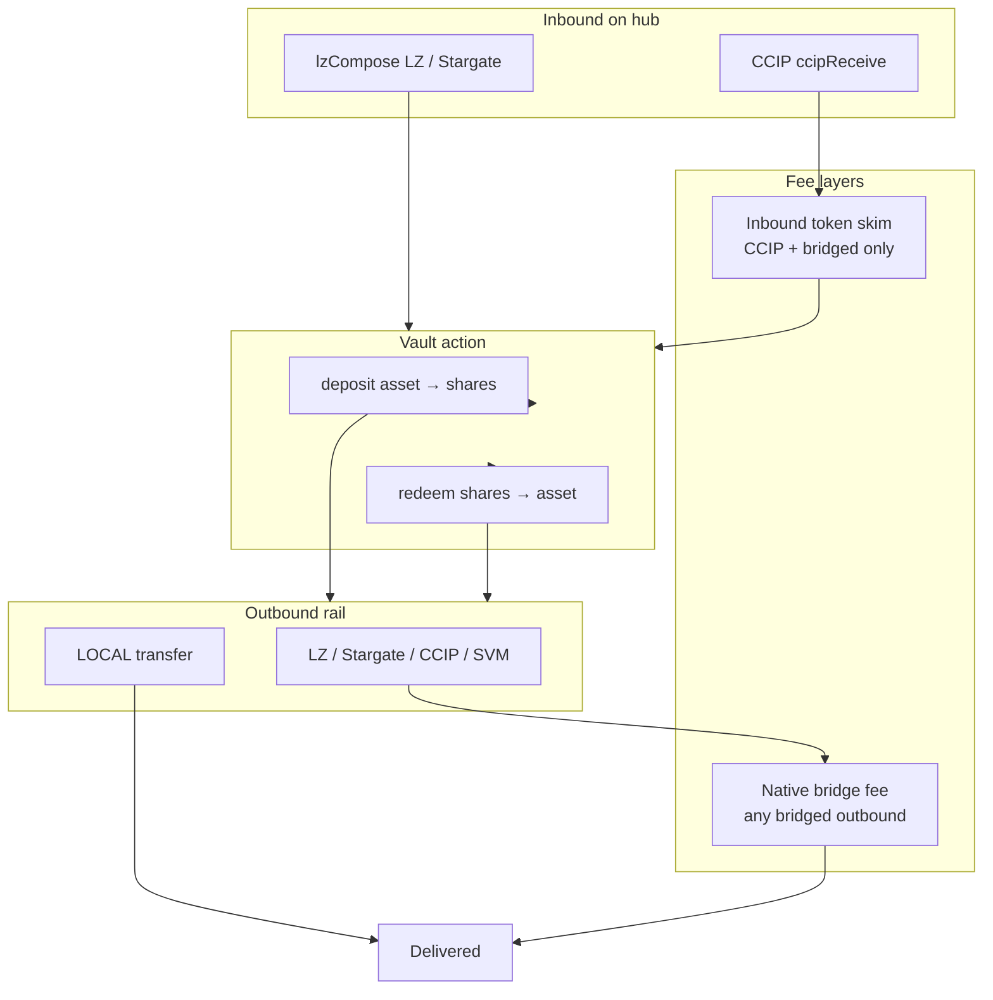

# Return-leg bridge handling

How the hub adapter funds and delivers the outbound ("return") leg after a cross-chain deposit or
redeem. CCIP is Chainlink's Cross-Chain Interoperability Protocol; LZ is LayerZero, whose OFT (Omnichain
Fungible Token) standard and EIDs (endpoint IDs) identify tokens and chains. SVM is the Solana
Virtual Machine (the `CCIP_SVM` rail). Operators: start with [`OPERATOR_GUIDE.md`](../operator/OPERATOR_GUIDE.md), then use
[Setting fees](#operator-guide-setting-fees) below for detail. This doc covers token directions,
inbound transport, outbound rails, and payer rules.

Primary reference: [`CrossChainVaultAdapter`](../../../src/multibridge/examples/CrossChainVaultAdapter.sol) on
[`RouteRegistry`](../../../src/multibridge/routing/RouteRegistry.sol) / [`MultiChannelBridgeAdapter`](../../../src/multibridge/MultiChannelBridgeAdapter.sol).

For rail configuration see [`FUNCTIONALITY.md`](./FUNCTIONALITY.md) and [`STARGATE.md`](./STARGATE.md).

---

## Operator guide: setting fees

Three questions per spoke route — answer them in order:

1. **Inbound channel** — How does this spoke reach the hub? **CCIP** or **LZ/Stargate**?
2. **Flow** — **Deposit** (asset in → shares out) or **redeem** (shares in → asset out)?
3. **Return route** — Where does the produced token go? The **`destination`** route key users put in `VaultMessage` (must match your `setRoute` key).

You configure **one route at a time** as `(outboundToken, destination)`. The inbound channel decides **which fee knob** you use.

### By inbound channel

| Spoke sends via | Operator sets | User / reserve pays native outbound |
|---|---|---|
| **CCIP** | `setInboundFee(outboundToken, destination, fee)` | **Reserve** (always) |
| **LZ / Stargate** | `setRequireLzReturnPrefunded(true)` | **User** attaches hub-native compose `value` |
| **Either → LOCAL** (`destination = 0`) | Nothing (no return-leg fees) | Nobody |

**CCIP spokes:** token skim recoups economics; reserve still pays the router's native fee on the outbound send. Withdraw skimmed tokens and top up reserve off-chain (or swap).

**LZ/Stargate spokes:** do **not** use `setInboundFee`. Users must quote and attach hub-native `value` on the compose send. Surplus refunds as **native ETH** to the message's `failedMessageHandler` (best-effort); with no handler it stays in the reserve.

### `setInboundFee` — keys and units

```solidity
setInboundFee(outboundToken, destination, fee)
```

| Flow | `outboundToken` | `fee` denominated in |
|---|---|---|
| Deposit → bridge **shares** | `address(vault)` | **Asset** (USDC, USDT, …) |
| Redeem → bridge **asset** | `address(asset)` | **Vault shares** |

- **`destination`** — exact route key users send and you pass to `setRoute` (e.g. Fuji CCIP selector, Arbitrum LZ EID). Not necessarily the wire `dstId` inside the route struct.
- **`fee = 0`** — disables skim for that pair; reserve alone funds CCIP return legs.
- **Sizing** — flat amount ≥ expected native return cost for that `(outToken, destination)` rail, expressed in inbound token units, plus buffer. Quote with `IRouterClient.getFee` / LZ quote on a test fork; revisit when gas moves.

Verify before go-live:

```solidity
s_inboundFees[outboundToken][destination]  // skim amount (0 = disabled)
// LOCAL / no-bridge: read route via RouteRegistry — fee not skimmed when delivery stays on hub
```

Withdraw accrual: `withdrawCollectedFee(token, treasury, amount)` — requires **`FEE_COLLECTOR_ROLE`**
(defaults to admin at deploy; override via `feeCollector` in `DeployConfig`).

### Access control (fee + admin)

Adapters use OpenZeppelin **AccessControl** (see [`DEPLOYMENT.md`](../operator/DEPLOYMENT.md) §3):

| Role | Fee-related functions |
|---|---|
| `FEE_SETTER_ROLE` | `setInboundFee`, `setRequireLzReturnPrefunded` |
| `FEE_COLLECTOR_ROLE` | `withdrawCollectedFee` |
| `DEFAULT_ADMIN_ROLE` | `recoverNative` (native balance only, never ERC-20 tokens), routes/allowlists, `grantRole` / `revokeRole`, `transferAdmin` |

At factory deploy, **`FEE_SETTER_ROLE`** and **`FEE_COLLECTOR_ROLE`** are granted to `owner`
(`feeCollector` in config overrides the collector address only). Revoke and re-grant to dedicated bots
when ready — fee bots do not need the admin key.

Recovery paths (`refundToSource`, `retryFailedMessage`, `refundLocal`) require **no role**.

### Reserve (`fundWei`)

Prefund hub-native on the adapter at deploy. Used when:

- **CCIP inbound** + bridged outbound (native CCIP/LZ router fee on every success).
- **LZ inbound** + bridged outbound **only if** `requireLzReturnPrefunded == false` (dev/bootstrap; avoid in production).

Size reserve for peak concurrent CCIP returns × quoted native fee per route. Monitor `address(adapter).balance`. `recoverNative` can withdraw any amount of the adapter's native balance (so withdraw only the excess); it cannot move ERC-20 tokens, so user and captured tokens are out of its reach.

### Per-spoke setup checklist

For each spoke the vault should serve:

```text
□ Allowlist inbound     setCcipSource(selector, true)  OR  setLzOft(eid, oft, true)
□ Allowlist outbound    setCcipDestination / setLzDestination / setStargateDestination (dstId)
□ Register return route setRoute(outToken, destination, Route{ enabled, rail, endpoint, dstId })
□ Set return-leg fee    CCIP → setInboundFee(outToken, destination, fee)  [FEE_SETTER_ROLE]
                        LZ   → setRequireLzReturnPrefunded(true)           [FEE_SETTER_ROLE]
                        (or pass both in factory.deploy DeployConfig / JSON inboundFees)
□ Optional              setDestinationGas(destination, gasLimit)
```

**Factory / JSON:** `factory.deploy(DeployConfig)` installs fees atomically on the 4626 adapter:

```json
"requireLzReturnPrefunded": true,
"inboundFees": [
  { "outboundToken": "share", "destination": 14767482510784806043, "fee": 50000 }
]
```

(`vaultAdapter` block in `config/multibridge/sepolia.json`; `returnLegFees` block in `config/multibridge/deployment.json`.)

**Deposit from spoke X, shares back to spoke X over CCIP:**

```solidity
app.setInboundFee(address(vault), DESTINATION_KEY, 50_000);  // e.g. 0.05 USDC (6 decimals)
```

**Redeem from spoke X, asset back to spoke X over CCIP:**

```solidity
app.setInboundFee(address(asset), DESTINATION_KEY, feeInShares);
```

**Deposit/redeem from spoke X over LZ/Stargate:**

```solidity
app.setRequireLzReturnPrefunded(true);
// Document for integrators: attach compose value >= hub quote for (outToken, destination)
```

**Hub-only delivery:**

```solidity
app.setRoute(outToken, 0, Route({ enabled: true, rail: Rail.LOCAL, endpoint: address(0), dstId: 0 }));
// No setInboundFee; fee = 0
```

### Production defaults

| Setting | Recommended value |
|---|---|
| `requireLzReturnPrefunded` | `true` on all LZ/Stargate spokes |
| `setInboundFee` | One non-zero fee per CCIP `(outToken, destination)` you enable |
| `fundWei` | Sized for CCIP outbound quotes; skimmed tokens recycle reserve off-chain |

---

## Vocabulary

| Term | Meaning |
|---|---|
| **Hub** | Chain where the vault + adapter live (e.g. Ethereum Sepolia). |
| **Spoke** | Source chain the user originates from (e.g. Arbitrum, Fuji). |
| **Inbound token** | Token the bridge delivers **to** the adapter on the hub. |
| **Outbound / produced token** | Token the vault action **creates** and the adapter sends onward. |
| **Return leg** | The outbound bridge (or LOCAL transfer) that delivers the produced token to `recipient` at `destination`. |
| **Reserve** | Native ETH (or hub gas token) prefunded on the adapter at deploy (`fundWei`) — used to pay CCIP/LZ router fees when no other payer is configured. |
| **Route key** | `VaultMessage.destination` — operator-registered key (often a spoke CCIP selector or LZ EID; `0` = LOCAL). |

### Inbound token ↔ vault action ↔ outbound token

The adapter accepts **exactly one** inbound ERC-20 per message:

| User intent | Inbound token (`inToken`) | Vault action | Produced token (`outToken`) |
|---|---|---|---|
| **Deposit** | Underlying **asset** (`s_asset`) | `deposit` | Vault **shares** (`s_vault`) |
| **Redeem** | Vault **shares** (`s_vault`) | `redeem` | Underlying **asset** (`s_asset`) |

All fee and routing logic is keyed off these two tokens plus `destination`.

### Inbound transport (how the hub receives the message)

| Channel | Entrypoint | Can deliver native gas? |
|---|---|---|
| **CCIP** | `ccipReceive` | **No** — tokens + `data` only |
| **LayerZero** | `lzCompose` (OFT compose) | **Yes** — optional compose `value` (hub-native ETH) |
| **Stargate** | `lzCompose` on the Stargate pool OFT | **Yes** — same as LayerZero |

Inbound auth is per channel (CCIP source selector, LZ `(srcEid, oft)` allowlists).

### Outbound rail (how the produced token leaves)

Selected by `s_route[outToken][destination]` when `enabled`, else legacy default:

| Rail | `destination` hint | Native bridge fee? |
|---|---|---|
| `LZ_OFT` | Route `dstId` = LZ EID | Yes (LZ endpoint) |
| `STARGATE` | Route `dstId` = LZ EID | Yes (Stargate/LZ) |
| `CCIP` | Route `dstId` = CCIP selector | Yes (CCIP router) |
| `CCIP_SVM` | Route `dstId` = CCIP selector (Solana) | Yes (CCIP router) |
| `LOCAL` | `LOCAL_DESTINATION` (`0`) + LOCAL route | **No** (ERC-20 `transfer`) |

Legacy fallback when no route is registered: `destination <= type(uint32).max` ⇒ LZ via `s_oftForToken[outToken]`; else CCIP to `destination` as chain selector.

---

## Two separate fee layers

Do not conflate these — they solve different problems:

### 1. Inbound-token protocol fee (CCIP only)

**Purpose:** CCIP cannot attach native gas. The operator charges a flat **inbound-token** skim to
recoup return-leg economics without subsidizing every CCIP user from reserve.

| Aspect | Detail |
|---|---|
| Setting | `setInboundFee(outboundToken, destination, fee)` — **`FEE_SETTER_ROLE`** |
| When charged | CCIP inbound **and** the delivery is not an enabled `LOCAL` route **and** `fee > 0` |
| Denomination | **Inbound token** smallest units (asset on deposit, shares on redeem) |
| Collection | Skimmed **before** vault action; credited to `s_collectedFees[inToken]` |
| Withdrawal | `withdrawCollectedFee(token, recipient, amount)` — **`FEE_COLLECTOR_ROLE`** |

Read fee config: `s_inboundFees(outboundToken, destination)` on the adapter clone.

**Not charged when:**

- Inbound is LayerZero or Stargate (use native prefund instead).
- The route for `(outboundToken, destination)` is an enabled `LOCAL` route (no bridge leg).
- Fee for that `(outboundToken, destination)` pair is zero.

**Failure:** `InboundFeeExceedsAmount` if `inAmount <= fee` → message captured for recovery.

### 2. Native bridge fee (outbound rail)

**Purpose:** Pay the CCIP router or LZ endpoint for the actual cross-chain send of the **produced**
token.

| Aspect | Detail |
|---|---|
| Setting | Operator prefunds reserve (`fundWei`); LZ policy `setRequireLzReturnPrefunded` — **`FEE_SETTER_ROLE`** |
| When charged | Any bridged outbound (`LZ_OFT`, `STARGATE`, `CCIP`, `CCIP_SVM`) |
| Denomination | Hub **native** (ETH on Sepolia) |
| Payer priority | See [Native fee payer rules](#native-fee-payer-rules) below |

`LOCAL` delivery: native fee = **0**.

---

## Native fee payer rules

After `_routeOut` quotes and pays the outbound native fee:

```text
if (msg.value > 0) {
    // LayerZero/Stargate delivered compose value
    require msg.value >= outboundNativeFee      // else revert ReturnFeeNotPrefunded (captured)
    surplus → refunded as native ETH to handler (best-effort); no handler / send fails → stays in reserve
} else if (bridged && requireLzReturnPrefunded && inbound == LayerZero) {
    revert ReturnNotPrefunded   // captured failure
} else if (bridged) {
    // Reserve pays outbound native fee
} else {
    // LOCAL: fee == 0; any msg.value returned to the handler (or kept in the reserve)
}
```

| Inbound channel | `msg.value` on inbound | `requireLzReturnPrefunded` | Outbound bridged? | Who pays native outbound fee |
|---|---|---|---|---|
| CCIP | 0 (always) | any | Yes | **Operator reserve** (unless inbound-token fee configured separately) |
| CCIP | 0 | any | No (LOCAL) | Nobody (0) |
| LayerZero / Stargate | `>=` quoted fee | any | Yes | **User prefund**; reserve untouched |
| LayerZero / Stargate | `>0` but `<` quoted fee | any | Yes | **Fails** (`ReturnFeeNotPrefunded`) |
| LayerZero / Stargate | `>0` | any | No (LOCAL) | Nobody; full prefund returned to the handler (or kept in the reserve) |
| LayerZero / Stargate | 0 | `false` | Yes | **Operator reserve** |
| LayerZero / Stargate | 0 | `true` | Yes | **Fails** (`ReturnNotPrefunded`) |
| LayerZero / Stargate | 0 | `true` | No (LOCAL) | Nobody; no prefund required |

**Production recommendation:** `setRequireLzReturnPrefunded(true)` so LZ/Stargate users must attach hub-native `value`; use `setInboundFee` for CCIP spokes.

---

## Happy-path matrix (synchronous ERC-4626)

Rows: inbound channel × user intent × outbound class.  
“Inbound skim” = layer 1 (`setInboundFee`). “Native outbound” = layer 2.

### Deposit (inbound **asset** → outbound **shares**)

| Inbound | Outbound | Inbound skim key | Inbound skim? | Native outbound payer |
|---|---|---|---|---|
| CCIP | LZ / Stargate / CCIP / SVM | `(s_vault, destination)` in **asset** units | If configured | Reserve |
| CCIP | LOCAL | — | No | 0 |
| LZ / Stargate | LZ / Stargate / CCIP / SVM | — | No | Prefund or reserve (see table above) |
| LZ / Stargate | LOCAL | — | No | 0 |

### Redeem (inbound **shares** → outbound **asset**)

| Inbound | Outbound | Inbound skim key | Inbound skim? | Native outbound payer |
|---|---|---|---|---|
| CCIP | LZ / Stargate / CCIP / SVM | `(s_asset, destination)` in **share** units | If configured | Reserve |
| CCIP | LOCAL | — | No | 0 |
| LZ / Stargate | LZ / Stargate / CCIP / SVM | — | No | Prefund or reserve |
| LZ / Stargate | LOCAL | — | No | 0 |

### Outbound rail specifics (produced token in transit)

| Outbound rail | Produced token sent | Extra notes |
|---|---|---|
| `LZ_OFT` | Full `outAmount` via hub-local OFT | `minAmountLD` may truncate shared-decimals dust |
| `STARGATE` | `outAmount` minus LP fee; floored by the user's `minAmountOut` (`minAmountLD`) | Canonical USDT/USDC on gap chains |
| `CCIP` | Full `outAmount` via CCIP pool | EVM recipient in low 20 bytes of `recipient` |
| `CCIP_SVM` | Full `outAmount` | Full 32-byte Solana token receiver |
| `LOCAL` | Full `outAmount` `transfer` on hub | Recipient must be EVM (`bytes32` high bits zero) |

---

## End-to-end flow

```text
Spoke: user sends inToken + VaultMessage{ minAmountOut, destination, recipient, failedMessageHandler, onlyLocalRefund }
        │
        ▼
Hub inbound (CCIP or lzCompose)
        │
        ├─ [CCIP + bridged] skim inbound fee → s_collectedFees[inToken]
        │
        ├─ vault: deposit(asset) or redeem(shares) on net amount
        │
        ├─ _routeOut(outToken, outAmount, minAmountOut, destination, recipient) → native bridge fee
        │
        └─ enforce native payer policy (prefund / reserve / revert)
```

`minAmountOut` is enforced on the **delivered** amount (after the skim and the vault action): measured on
the recipient's balance for `LOCAL`, checked against the sent amount for `CCIP`/`CCIP_SVM`, and passed as
the bridge's `minAmountLD` for `LZ_OFT`/`STARGATE`.

---

## Worked examples

See [Operator guide](#operator-guide-setting-fees) for the setup pattern; these are concrete instances.

### Fuji USDC deposit → shares back to Fuji (CCIP both ways)

- Inbound: USDC over CCIP from Fuji selector.
- Outbound: vault shares over CCIP to Fuji (`s_route[vault][fujiSelector].rail == CCIP`).
- Operator sets: `setInboundFee(vault, fujiSelector, <usdcFlatFee>)` — skim USDC before deposit.
- Native CCIP send fee: paid from **reserve** (withdraw collected USDC off-chain to top up reserve, or swap).

### Arbitrum USDT deposit → shares over LZ (LZ in, LZ out)

- Inbound: USDT via Stargate/LZ compose.
- Outbound: shares via `LZ_OFT` to Arbitrum EID.
- No inbound token skim.
- User should attach compose `value` ≥ the hub's LayerZero quote for the share OFT send, or the reserve pays if `requireLzReturnPrefunded == false`.

### Hub-local delivery (`destination = 0`, LOCAL route)

- Any inbound channel; produced token transferred on hub to `recipient`.
- No inbound skim; no native outbound fee.
- LZ compose `value` (if any) returned in full to the handler (or kept in the reserve when there is none).

---

## Failure and recovery (who pays native)

When `_handleReceive` reverts, the base **captures** the inbound token (the vault action and any skim
roll back). Recovery paths take the captured `Inbound` (decoded from `MessageFailed`) and **never draw
the reserve**:

| Path | Who calls | Native fee |
|---|---|---|
| `refundToSource(inbound)` | Anyone (unless `onlyLocalRefund` with a handler) | **Caller** via `msg.value` (bounce back on inbound rail) |
| `retryFailedMessage(inbound)` | `failedMessageHandler` | **Caller** via `msg.value` (re-runs full happy path; skim applies again) |
| `refundLocal(inbound, to)` | Handler only | **None** (local ERC-20 transfer) |

The reserve is intended only for the **original** successful double-hop (spoke → hub vault → spoke).

---

## Quick reference diagram



---

## Related code

| Topic | Location |
|---|---|
| Inbound skim + native policy | `CrossChainVaultAdapter._handleReceive`, `_skimInboundFee` |
| Outbound routing | `RouteRegistry._routeOut`, `_deliverViaRoute` |
| LZ surplus refund | `MultiChannelBridgeAdapter._refundDeliveredValueSurplus` |
| Recovery | `MultiChannelBridgeAdapter.refundToSource`, `retryFailedMessage`, `refundLocal` |
